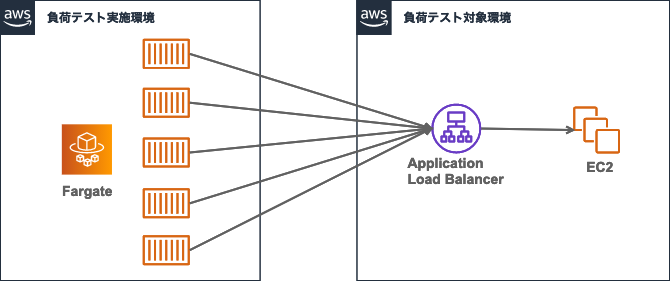
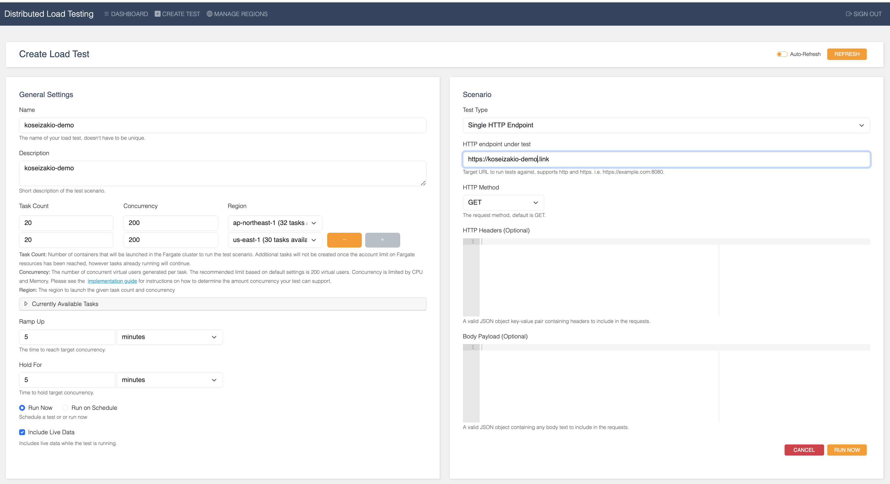

# CloudWatch-SNS サンプル

Cloudformationで VPC-EC2-ELBの構築を自動化した。

EC2は、CPUの過負荷が謙虚に出るように```t3.nano```のインスタンスを利用した。

EC2でLinuxにnginxをインストールして、[index.html](./index.html)を表示させるようにした。

Route53でELBと紐付け、AWS ACMでSSL化した。

https://koseizakio-demo.link


## Koseizakio-demoのWeb構成図


 
## Koseizakio-demoのWebサイトの見積

- [AWS Pricing Calculator による見積もり](https://calculator.aws/#/estimate?id=e771e6dea3590228809e79230639bf8c7b6acefc)

- koseizakio-demo.linkのドメイン料金年間約800円(5.5ドル)

- ロードバランサー(ELB)とWebサーバー(EC2)月額約4258円(29.33ドル)

# Cloudwatch

## 例)CPUUtilization > 10 ：CPU使用率が10%以上にする

EC2(Linux)でstressコマンドでCPUにわざと負荷をかける

```stress --cpu 1 --timeout 3m``` 

異常から正常に復帰した時もメールが送信できるように、SNSで設定した。

## 例)UnHealthyHostCount >= 1 ：ELBのヘルスチェックが失敗する

``` sudo service nginx stop ``` するとWebアプリが利用できなくなりUnHealthyHostCountが0から1になる

``` sudo service nginx start ```にするとWebアプリが利用可能になりUnHealthyHostCountが1から0になる

サーバーエラー。サーバー側の問題が発生した場合、メール通知できるようにする。

## AWS SNS メールの通知スレッド


# AWS での分散負荷テスト導入

「AWS での分散負荷テスト」ソリューションでは、アプリケーションをリリースする前に、ソフトウェアアプリケーションの大規模および負荷時のテストを自動化して、ボトルネックを特定することがで きます。このソリューションは、一定のペースでトランザクションレコードを生成する数多くの接続ユーザーを作成およびシミュレートします。

[テンプレート](https://s3.us-east-1.amazonaws.com/distributed-load-testing-dlttestrunnerstoragedlts-39d6y5p6n8pv/regional-template/distributed-load-testing-on-aws-regional.template)

- テンプレートをAWS Cloudformationで実行する。

- 登録したメールから ```https://XXXw.cloudfront.net/``` があるので負荷テストサイトを利用する。

## 分散負荷テストの目的


分散負荷テストとは、システムやアプリケーションが多数の同時アクセスに耐えられるかどうかをテストする手法です。分散負荷テストでは、複数のテストクライアントからシステムやアプリケーションに同時アクセスを発生させ、システムやアプリケーションのパフォーマンスや安定性を評価します。

分散負荷テストを行う目的は、次のとおりです。

- システムやアプリケーションが想定される負荷に耐えられるかどうかを評価する。
- システムやアプリケーションのボトルネックを特定する。
- システムやアプリケーションのパフォーマンスを向上させる。
- システムやアプリケーションの信頼性を向上させる。

## AWSの負荷テストの検証イメージ



## 動作画面



## 制限

最大負荷は10,000の同時リクエスト（デフォルト）

Fargateで起動できるデフォルトのタスク数は50、タスクごとに最大で200の同時接続を生成します

同時リクエストを増やす場合、タスク数の上限緩和申請します

テストの最大実行時間は4時間


## 料金

月額31ドル/月 ✖️ 利用するリージョンの数

## 参考URL・参考書

- クラウドエンジニアの教科書 P.297 - P.306「クラウドの監視サービスの実例」

- [AWS CloudWatchでロードバランサーのターゲットがアンヘルシーになった時に通知する](https://it-ouji.com/2021/02/17/aws-cloudwatch%E3%81%A7%E3%83%AD%E3%83%BC%E3%83%89%E3%83%90%E3%83%A9%E3%83%B3%E3%82%B5%E3%83%BC%E3%81%AE%E3%82%BF%E3%83%BC%E3%82%B2%E3%83%83%E3%83%88%E3%81%8C%E3%82%A2%E3%83%B3%E3%83%98%E3%83%AB/)

- [AWS の障害をどう検知させ、どう通知するか？](https://aws.taf-jp.com/blog/64788#AWS_%E3%81%AE%E9%9A%9C%E5%AE%B3%E6%A4%9C%E7%9F%A5%E3%80%80EC2_%E3%81%AEOS%E9%9A%9C%E5%AE%B3%E3%82%92%E6%A4%9C%E7%9F%A5%E3%81%99%E3%82%8B)

- [AWSの負荷テストソリューションを試してみた](https://dev.classmethod.jp/articles/distributed-load-testing-on-aws/)

- [AWS での分散負荷テスト](https://d1.awsstatic.com/Solutions/ja_JP/distributed-load-testing-on-aws.pdf)