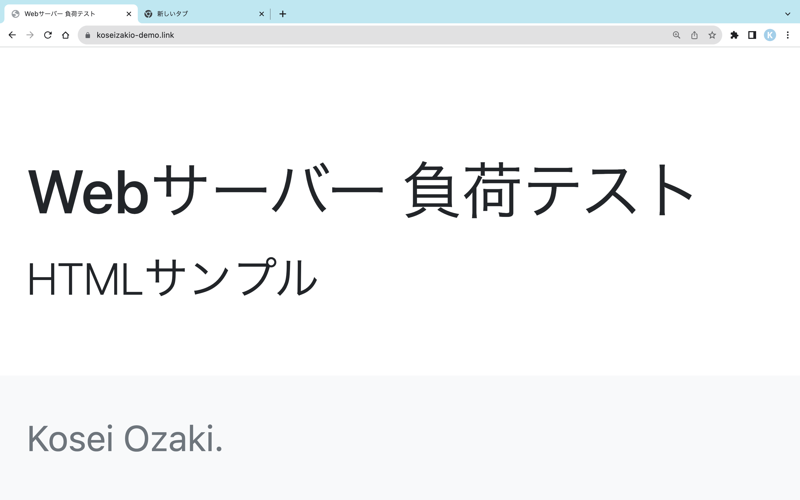
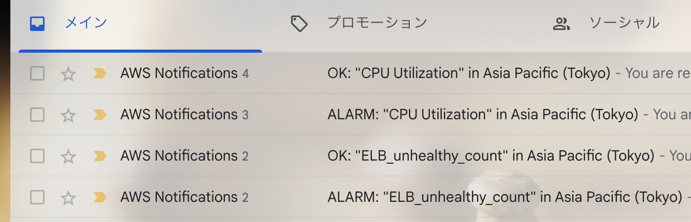

# CloudWatch-SNS サンプル

Cloudformationで VPC-EC2-ELBの構築を自動化した。

EC2は、CPUの過負荷が謙虚に出るように```t3.nano```のインスタンスを利用した。

EC2でLinuxにnginxをインストールして、[index.html](./index.html)を表示させるようにした。

Route53でELBと紐付け、AWS ACMでSSL化した。

https://koseizakio-demo.link


 
## Koseizakio-demoのWebサイトの見積

- [AWS Pricing Calculator による見積もり](https://calculator.aws/#/estimate?id=e771e6dea3590228809e79230639bf8c7b6acefc)

- koseizakio-demo.linkのドメイン料金年間約800円(5.5ドル)

- ロードバランサー(ELB)とWebサーバー(EC2)月額約4258円(29.33ドル)

# Cloudwatch

## 例)CPUUtilization > 10 ：CPU使用率が10%以上にする

EC2(Linux)でstressコマンドでCPUにわざと負荷をかける

```stress --cpu 1 --timeout 3m``` 

異常から正常に復帰した時もメールが送信できるように、SNSで設定した。

## 例)UnHealthyHostCount >= 1 ：ELBのヘルスチェックが失敗する

``` sudo service nginx stop ``` するとWebアプリが利用できなくなりUnHealthyHostCountが0から1になる

``` sudo service nginx start ```にするとWebアプリが利用可能になりUnHealthyHostCountが1から0になる

サーバーエラー。サーバー側の問題が発生した場合、メール通知できるようにする。

## AWS SNS メールの通知スレッド



## 参考URL・参考書

- クラウドエンジニアの教科書 P.297 - P.306「クラウドの監視サービスの実例」

- [AWS CloudWatchでロードバランサーのターゲットがアンヘルシーになった時に通知する](https://it-ouji.com/2021/02/17/aws-cloudwatch%E3%81%A7%E3%83%AD%E3%83%BC%E3%83%89%E3%83%90%E3%83%A9%E3%83%B3%E3%82%B5%E3%83%BC%E3%81%AE%E3%82%BF%E3%83%BC%E3%82%B2%E3%83%83%E3%83%88%E3%81%8C%E3%82%A2%E3%83%B3%E3%83%98%E3%83%AB/)